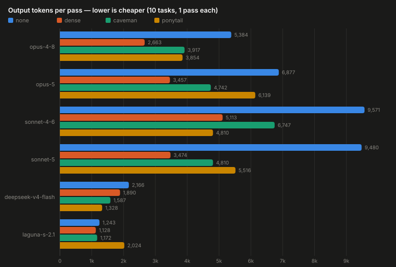
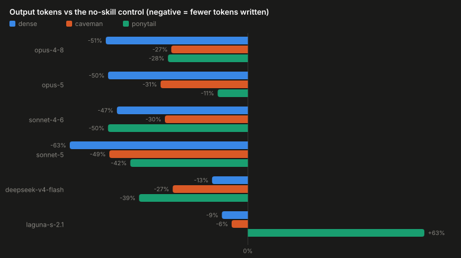
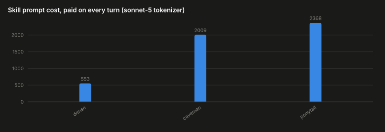
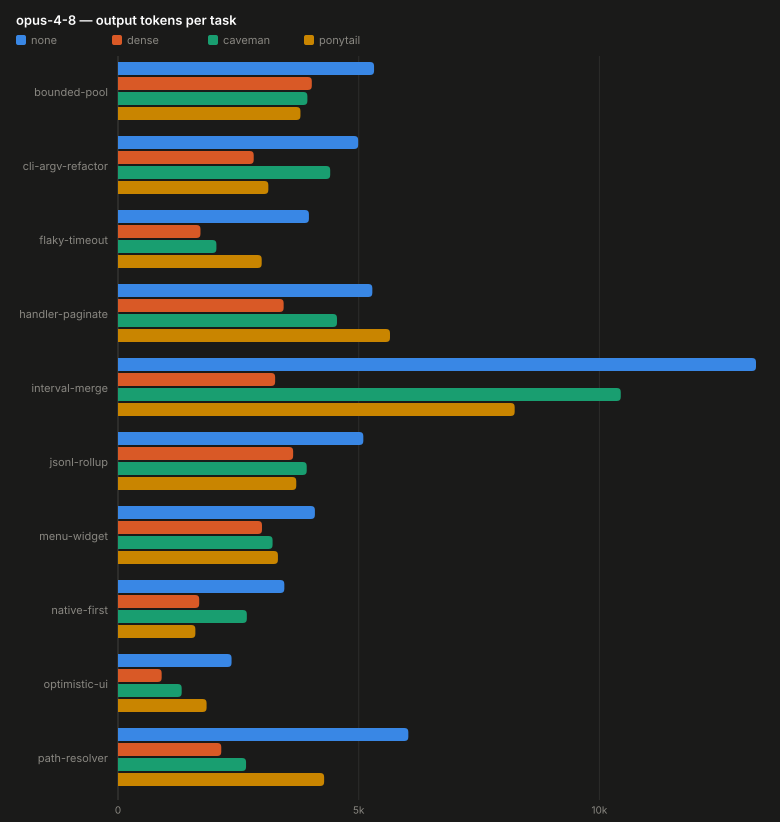
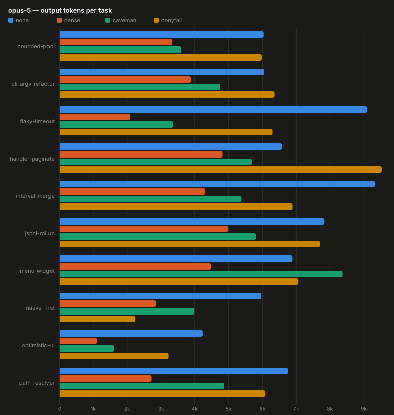
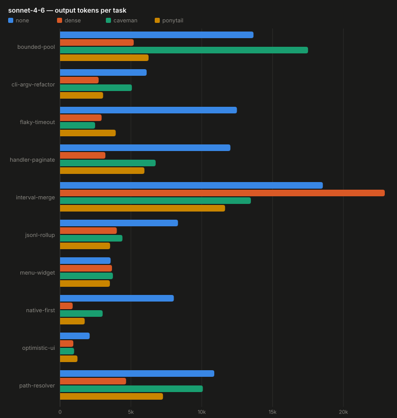
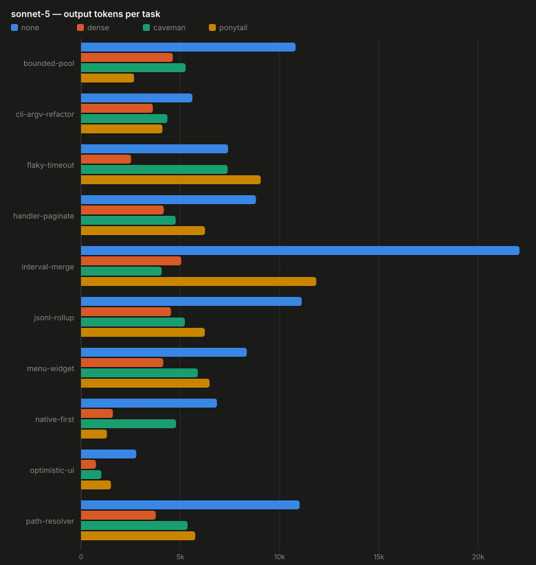
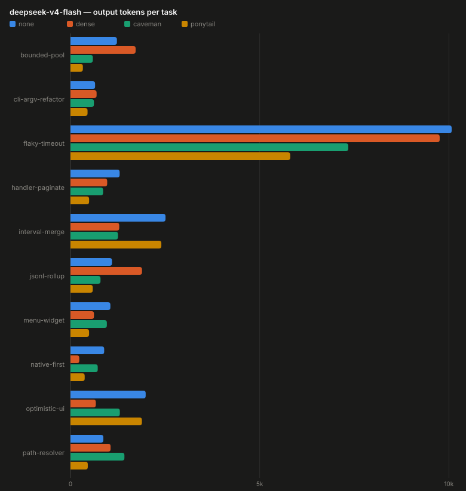
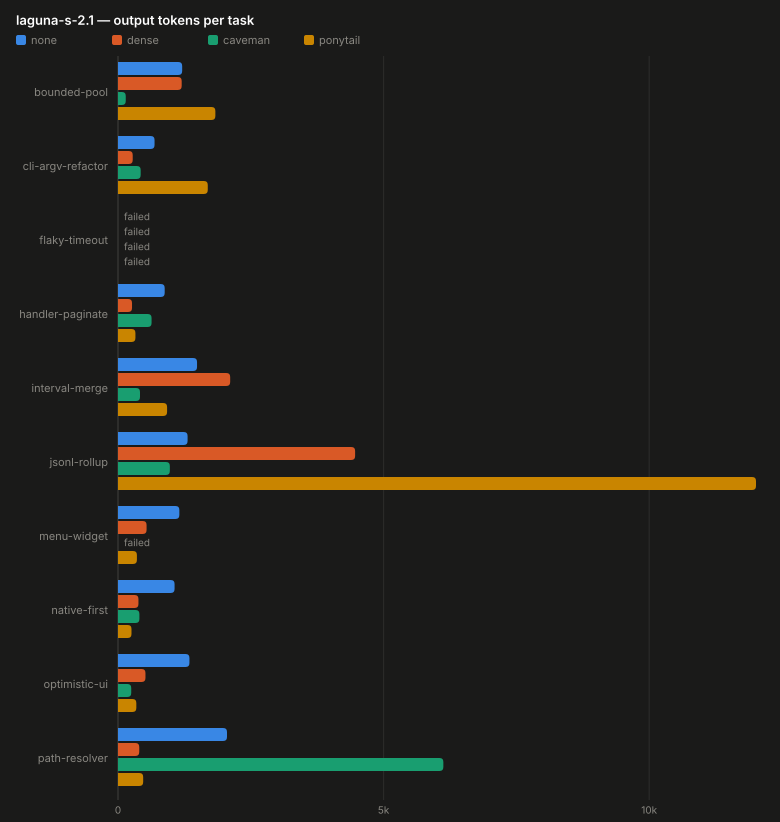
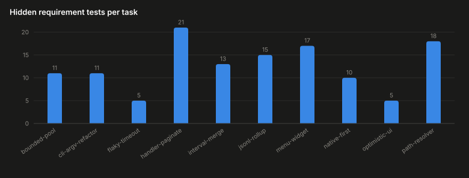

<p align="center">
  
</p>

# DENSE

A ~550-token skill prompt that makes a coding model write less — less prose, less code, less
ceremony — **without trading away correctness**. `SKILL.md` is the whole thing (MIT).

```bash
mkdir -p ~/.claude/skills/dense && cp SKILL.md ~/.claude/skills/dense/
# or paste its body in as a system prompt for any model
```

The claim it makes is narrow and testable: *terseness instructions save tokens; do they cost
correctness?* Everything below comes from **executing model-written code against hidden
tests** — never from reading the model's prose.

Six recent models — Opus 5, Opus 4.8, Sonnet 5, Sonnet 4.6, DeepSeek V4 Flash and Laguna
S 2.1 — were benchmarked with no skill, with DENSE, and against two popular terseness
prompts, **caveman** and **ponytail**:



## Building the skill

DENSE was not written in one sitting. It is the output of five phases across several months,
four of which were some form of model-in-the-loop search.

| phase | what happened | judged on |
|---|---|---|
| **0. Research** | A Claude Code deep-research session on how to reduce output tokens — the findings became the first draft. | reading, not measurement |
| **1. First RSI loop** | Opus 4.6 mutated the skill each generation, sometimes free-running, sometimes with a steer ("look at this repository and find a vector to improve DENSE"). Winner of each generation became the next base. ~10 generations. | benchmarked on MiniMax M2.7, Sonnet 4.6, Opus 4.6 |
| **2. Compression pass** | Months later, GPT-5.6 Sol compressed the prompt itself — examples and redundant phrasing dropped — with the constraint that measured savings must not regress. | Luna 5.6, DeepSeek V4 Flash |
| **3. Second RSI loop** | Fable built a more reproducible loop: each candidate **adds, removes, or rephrases exactly one line**, so a win is attributable to a specific edit rather than a rewrite. 8 more generations. | Sonnet 5, Sonnet 4.6, Opus 4.8, Fable 5, Deepseek v4 Flash |
| **4. Validation** | The run reported below — a different, larger model set than any generation was selected on. | Opus 5, Opus 4.8, Sonnet 4.6, Sonnet 5, DeepSeek V4 Flash, Laguna S 2.1 |

Three deliberate choices did most of the work:

**Every generation was scored on several models at once.** A prompt tuned against one model
learns that model's habits. Selecting on the worst-case across a mixed set is slower and
crowns fewer candidates, but what survives is a prompt rather than a fit.

**The prompt itself is a cost, so it was optimized as one.** Phase 2 exists because a skill
that saves 3,000 output tokens while spending 2,400 on its own instructions has saved
almost nothing — the prompt is re-sent every turn. DENSE's 553 tokens against the
alternatives' 2,009 and 2,368 is the result of a pass that treated its own text as the
target.

**One-line candidates beat rewrites.** The phase-3 loop restricted each mutation to a single
added, removed, or rephrased line. Whole-prompt/broad rewrites produce winners you cannot explain
and cannot decompose; one-line edits produce a changelog.

Artifacts from phases 0–3 are not preserved in this repository; that history is narrative,
and only the validation numbers below are reproducible here.

## Results

6 models × 4 arms × 10 tasks, one pass per cell, 2026-07-25, Claude Code CLI 2.1.220.
`none` is a neutral system prompt; `caveman` and `ponytail` are two other published
compression skills, included so DENSE is measured against alternatives rather than only
against nothing.

`req` = fraction of hidden requirement tests passed. `out tok` = output tokens per pass.
`Δout` = versus that model's `none` arm. `prompt` = the skill's own input cost per turn.

| model | arm | req | out tok | Δout | prompt | spend $ |
|---|---|---:|---:|---:|---:|---:|
| opus-4-8 | none | 0.990 | 5,384 | — | 22 | 2.11 |
| opus-4-8 | **dense** | 0.990 | **2,663** | **−51%** | 553 | 1.22 |
| opus-4-8 | caveman | 0.966 | 3,917 | −27% | 2,009 | 1.82 |
| opus-4-8 | ponytail | 0.990 | 3,854 | −28% | 2,368 | 1.84 |
| opus-5 | none | 1.000 | 6,877 | — | 22 | 2.72 |
| opus-5 | **dense** | 0.990 | **3,457** | **−50%** | 553 | 1.59 |
| opus-5 | caveman | 1.000 | 4,742 | −31% | 2,009 | 2.21 |
| opus-5 | ponytail | 1.000 | 6,139 | −11% | 2,368 | 2.79 |
| sonnet-4-6 | none | 1.000 | 9,571 | — | 12 | 2.33 |
| sonnet-4-6 | dense | 0.967 | 5,113 | −47% | 385 | 1.32 |
| sonnet-4-6 | caveman | 0.966 | 6,747 | −30% | 1,410 | 1.80 |
| sonnet-4-6 | **ponytail** | 0.976 | **4,810** | **−50%** | 1,753 | 1.39 |
| sonnet-5 | none | 1.000 | 9,480 | — | 22 | 2.31 |
| sonnet-5 | **dense** | 0.991 | **3,474** | **−63%** | 553 | 0.99 |
| sonnet-5 | caveman | 0.991 | 4,810 | −49% | 2,009 | 1.43 |
| sonnet-5 | ponytail | 0.967 | 5,516 | −42% | 2,368 | 1.60 |
| deepseek-v4-flash | none | 0.981 | 2,166 | — | 12 | 0.02 |
| deepseek-v4-flash | dense | 0.990 | 1,890 | −13% | 336 | 0.02 |
| deepseek-v4-flash | caveman | 0.958 | 1,587 | −27% | 1,416 | 0.03 |
| deepseek-v4-flash | **ponytail** | 1.000 | **1,328** | **−39%** | 1,843 | 0.03 |
| laguna-s-2.1 † | none | 1.000 | 1,243 | — | 12 | 0.05 |
| laguna-s-2.1 † | dense | 1.000 | 1,128 | −9% | 352 | 0.04 |
| laguna-s-2.1 † | caveman | 0.988 | 1,172 | −6% | 1,293 | 0.04 |
| laguna-s-2.1 † | ponytail | 0.952 | 2,024 | +63% | 1,630 | 0.08 |




† Not comparable to the other rows — see caveats. deepseek-v4-flash was served by GMICloud
(fp8) with provider fallback disabled; laguna-s-2.1 by Poolside, both via OpenRouter.

Regression rate (pre-existing behavior still works) was **1.00 in every cell** except
`caveman × deepseek` at 0.89. Total spend for the sweep: $29.78 — opus-5 $9.32,
opus-4-8 $6.99, sonnet-4-6 $6.84, sonnet-5 $6.33, laguna $0.22, deepseek $0.09.

## What the numbers say

**DENSE roughly halves output on frontier Claude models at no measurable correctness cost.**
−47% to −63% output tokens on all four, with requirement rate within 0.01 of no-skill on
three of them. On sonnet-5 that is $0.99 against the control's $2.31 for identical work.

**It is the cheapest skill per unit of compression.** DENSE's prompt is 553 tokens against
caveman's 2,009 and ponytail's 2,368 — a quarter to a third — and it still compresses more
than either on every Claude model. Prompt overhead is paid on *every turn*, so on short
sessions the rivals can cost more in prompt than they save in output.




**No skill wins everywhere.** Ponytail beats DENSE on sonnet-4-6 and deepseek, and is close
to useless on opus-5 (−11% for the largest prompt in the set). Caveman never wins a model
outright here. If you care about one specific model, measure it rather than trusting a
leaderboard.

**Compression has a floor set by the model's own verbosity.** Laguna already answers in
~1,200 tokens unprompted; DENSE takes it to ~1,100, a −9% move against −47% to −63% on the
Claude models. A compression skill can only remove ceremony the model was going to write.

**The one repeatable correctness effect is enumeration.** On sonnet-4-6, `menu-widget` scored
1.00 with no skill and **exactly 0.76 under all three compression skills**. Three
independently written prompts landing on the same value is a property of compression
pressure, not of any one skill: terseness instructions make models skip enumerated cases.
If your task is "handle each of these N cases", expect this and say so explicitly.

## Per-model detail

Cells are `req (output tokens)`. **`failed`** means the pass never completed — see the laguna
note. `draws used` shows how many draws were spent to fill 10 task slots; anything above 10
means a collapsed or failed draw was re-run.

### How wide is the margin?

These runs are one pass per cell, and an LLM is not deterministic — the same prompt on the
same task can produce a different program each time. So before reading any gap as an effect,
size it against a single hidden test flipping:

| task size | one test | effect on that model's mean req |
|---|---:|---:|
| 5 tests (`flaky-timeout`, `optimistic-ui`) | 0.200 | 0.020 |
| 10–11 tests (`native-first`, `bounded-pool`, `cli-argv-refactor`) | 0.091–0.100 | ~0.010 |
| 17–21 tests (`menu-widget`, `handler-paginate`) | 0.048–0.059 | ~0.005 |

**Every mean-req gap below ~0.03 in these tables is one or two tests, and should be read as
"no measured difference."** Deeper runs on a subset of these cells (24–48 passes per arm)
confirmed this the hard way: two effects that looked mechanistic at four passes — a
perfectly repeatable per-pass failure, and a 50% collapse rate — both dissolved entirely
when re-measured. Output tokens are the stable column; treat `req` as a guard against gross
regression, not as a ranking.

A useful sanity check runs through the tables below: where a task fails, it usually fails in
**every** arm at the same value. That pattern is the task, not the skill.

### opus-4-8




| task | tests | none | dense | caveman | ponytail |
|---|---:|---|---|---|---|
| `bounded-pool` | 11 | 1.00 (5,319) | 1.00 (4,026) | 1.00 (3,934) | 1.00 (3,790) |
| `cli-argv-refactor` | 11 | 1.00 (4,989) | 1.00 (2,819) | 1.00 (4,408) | 1.00 (3,123) |
| `flaky-timeout` | 5 | 1.00 (3,966) | 1.00 (1,713) | 1.00 (2,044) | 1.00 (2,985) |
| `handler-paginate` | 21 | 1.00 (5,283) | 1.00 (3,441) | 1.00 (4,549) | 1.00 (5,650) |
| `interval-merge` | 13 | 1.00 (13,253) | 1.00 (3,264) | 1.00 (10,444) | 1.00 (8,240) |
| `jsonl-rollup` | 15 | 1.00 (5,096) | 1.00 (3,638) | 1.00 (3,920) | 1.00 (3,703) |
| `menu-widget` | 17 | 1.00 (4,090) | 1.00 (2,991) | 0.76 (3,211) | 1.00 (3,322) |
| `native-first` | 10 | 0.90 (3,455) | 0.90 (1,687) | 0.90 (2,676) | 0.90 (1,607) |
| `optimistic-ui` | 5 | 1.00 (2,359) | 1.00 (907) | 1.00 (1,323) | 1.00 (1,840) |
| `path-resolver` | 18 | 1.00 (6,031) | 1.00 (2,145) | 1.00 (2,660) | 1.00 (4,282) |
| **mean req** | | 0.990 | 0.990 | 0.966 | 0.990 |
| **out tok/pass** | | 5,384 | 2,663 | 3,917 | 3,854 |
| **Δout vs none** | | — | −51% | −27% | −28% |
| **completed** | | 10/10 | 10/10 | 10/10 | 10/10 |
| **prompt tok** | | 22 | 553 | 2,009 | 2,368 |
| **spend $** | | 2.11 | 1.22 | 1.82 | 1.84 |

**At ceiling; token effect only.** Nine of ten tasks are 1.00 in all four arms.
`native-first` is 0.90 everywhere including no-skill — one test the model misses regardless
of prompt, so it says nothing about any skill. Caveman's `menu-widget` 0.76 (4 of 17 tests)
is the only arm-specific miss and is a single unreplicated draw. DENSE halves output with
identical correctness, and `interval-merge` shows where the savings come from: 13,253 tokens
with no skill against 3,264 — the same solution, four times less deliberation written down.

### opus-5




| task | tests | none | dense | caveman | ponytail |
|---|---:|---|---|---|---|
| `bounded-pool` | 11 | 1.00 (6,035) | 1.00 (3,336) | 1.00 (3,599) | 1.00 (5,979) |
| `cli-argv-refactor` | 11 | 1.00 (6,047) | 1.00 (3,888) | 1.00 (4,746) | 1.00 (6,362) |
| `flaky-timeout` | 5 | 1.00 (9,097) | 1.00 (2,090) | 1.00 (3,357) | 1.00 (6,300) |
| `handler-paginate` | 21 | 1.00 (6,583) | 1.00 (4,821) | 1.00 (5,679) | 1.00 (9,536) |
| `interval-merge` | 13 | 1.00 (9,327) | 1.00 (4,305) | 1.00 (5,386) | 1.00 (6,898) |
| `jsonl-rollup` | 15 | 1.00 (7,836) | 1.00 (4,981) | 1.00 (5,801) | 1.00 (7,702) |
| `menu-widget` | 17 | 1.00 (6,895) | 1.00 (4,482) | 1.00 (8,377) | 1.00 (7,058) |
| `native-first` | 10 | 1.00 (5,964) | 0.90 (2,850) | 1.00 (3,993) | 1.00 (2,245) |
| `optimistic-ui` | 5 | 1.00 (4,229) | 1.00 (1,107) | 1.00 (1,614) | 1.00 (3,222) |
| `path-resolver` | 18 | 1.00 (6,758) | 1.00 (2,713) | 1.00 (4,865) | 1.00 (6,087) |
| **mean req** | | 1.000 | 0.990 | 1.000 | 1.000 |
| **out tok/pass** | | 6,877 | 3,457 | 4,742 | 6,139 |
| **Δout vs none** | | — | −50% | −31% | −11% |
| **completed** | | 10/10 | 10/10 | 10/10 | 10/10 |
| **prompt tok** | | 22 | 553 | 2,009 | 2,368 |
| **spend $** | | 2.72 | 1.59 | 2.21 | 2.79 |

**Saturated suite; the only signal is cost.** 39 of 40 cells are 1.00. DENSE's 0.990 is one
test on `native-first` — 0.010 of mean, i.e. inside the margin defined above. The
interesting row is ponytail: −11% output for the largest prompt in the set, so at 2,368
tokens/turn it costs more than it saves and lands $0.07 *above* the no-skill arm. DENSE at
−50% for 553 tokens/turn is the only arm that clearly pays for itself here.

### sonnet-4-6




| task | tests | none | dense | caveman | ponytail |
|---|---:|---|---|---|---|
| `bounded-pool` | 11 | 1.00 (13,652) | 0.91 (5,200) | 1.00 (17,502) | 1.00 (6,247) |
| `cli-argv-refactor` | 11 | 1.00 (6,112) | 1.00 (2,722) | 1.00 (5,070) | 1.00 (3,038) |
| `flaky-timeout` | 5 | 1.00 (12,482) | 1.00 (2,932) | 1.00 (2,474) | 1.00 (3,929) |
| `handler-paginate` | 21 | 1.00 (12,022) | 1.00 (3,200) | 1.00 (6,747) | 1.00 (5,954) |
| `interval-merge` | 13 | 1.00 (18,546) | 1.00 (22,918) | 1.00 (13,467) | 1.00 (11,646) |
| `jsonl-rollup` | 15 | 1.00 (8,322) | 1.00 (4,005) | 1.00 (4,402) | 1.00 (3,532) |
| `menu-widget` | 17 | 1.00 (3,569) | 0.76 (3,665) | 0.76 (3,730) | 0.76 (3,516) |
| `native-first` | 10 | 1.00 (8,029) | 1.00 (890) | 0.90 (3,006) | 1.00 (1,740) |
| `optimistic-ui` | 5 | 1.00 (2,091) | 1.00 (937) | 1.00 (991) | 1.00 (1,230) |
| `path-resolver` | 18 | 1.00 (10,885) | 1.00 (4,659) | 1.00 (10,076) | 1.00 (7,265) |
| **mean req** | | 1.000 | 0.967 | 0.966 | 0.976 |
| **out tok/pass** | | 9,571 | 5,113 | 6,747 | 4,810 |
| **Δout vs none** | | — | −47% | −30% | −50% |
| **completed** | | 10/10 | 10/10 | 10/10 | 10/10 |
| **prompt tok** | | 12 | 385 | 1,410 | 1,753 |
| **spend $** | | 2.33 | 1.32 | 1.80 | 1.39 |

**The one model where compression visibly costs something — and it is not skill-specific.**
`menu-widget` is 1.00 with no skill and **exactly 0.76 under all three skills**. Three
independently written prompts converging on the same four failed tests is the clearest
result in this sweep: compression pressure makes the model skip enumerated cases. The three
skills' mean-req spread (0.966–0.976) is well inside the margin and should not be ranked.

This model also carries the sweep's best illustration of single-pass variance: DENSE on
`interval-merge` wrote **22,918 tokens, more than the no-skill arm's 18,546**, on a task
where it used 3,264 on opus-4-8. One draw went down a long path. It is the reason the
−47% figure should be read as approximate.

### sonnet-5




| task | tests | none | dense | caveman | ponytail |
|---|---:|---|---|---|---|
| `bounded-pool` | 11 | 1.00 (10,803) | 0.91 (4,620) | 0.91 (5,267) | 0.91 (2,668) |
| `cli-argv-refactor` | 11 | 1.00 (5,607) | 1.00 (3,615) | 1.00 (4,349) | 1.00 (4,097) |
| `flaky-timeout` | 5 | 1.00 (7,403) | 1.00 (2,518) | 1.00 (7,382) | 1.00 (9,049) |
| `handler-paginate` | 21 | 1.00 (8,809) | 1.00 (4,166) | 1.00 (4,765) | 1.00 (6,241) |
| `interval-merge` | 13 | 1.00 (22,082) | 1.00 (5,042) | 1.00 (4,059) | 1.00 (11,846) |
| `jsonl-rollup` | 15 | 1.00 (11,113) | 1.00 (4,526) | 1.00 (5,227) | 1.00 (6,231) |
| `menu-widget` | 17 | 1.00 (8,347) | 1.00 (4,143) | 1.00 (5,878) | 0.76 (6,471) |
| `native-first` | 10 | 1.00 (6,844) | 1.00 (1,602) | 1.00 (4,785) | 1.00 (1,300) |
| `optimistic-ui` | 5 | 1.00 (2,781) | 1.00 (749) | 1.00 (1,020) | 1.00 (1,503) |
| `path-resolver` | 18 | 1.00 (11,008) | 1.00 (3,761) | 1.00 (5,364) | 1.00 (5,751) |
| **mean req** | | 1.000 | 0.991 | 0.991 | 0.967 |
| **out tok/pass** | | 9,480 | 3,474 | 4,810 | 5,516 |
| **Δout vs none** | | — | −63% | −49% | −42% |
| **completed** | | 10/10 | 10/10 | 10/10 | 10/10 |
| **prompt tok** | | 22 | 553 | 2,009 | 2,368 |
| **spend $** | | 2.31 | 0.99 | 1.43 | 1.60 |

**DENSE's best model.** −63% output at 0.991, and the cheapest cell in the entire sweep
outside the two OpenRouter models: $0.99 against $2.31 for the same ten tasks. Again the
failures cluster by task, not by skill — `bounded-pool` is 0.91 (one test of eleven) in all
three skill arms and 1.00 with none, and ponytail additionally drops `menu-widget` to 0.76.
`interval-merge` repeats the opus-4-8 pattern at larger scale: 22,082 tokens with no skill
versus 5,042 with DENSE, same score.

### deepseek-v4-flash @ GMICloud (fp8, provider pinned)




| task | tests | none | dense | caveman | ponytail |
|---|---:|---|---|---|---|
| `bounded-pool` | 11 | 0.91 (1,227) | 1.00 (1,721) | 1.00 (590) | 1.00 (327) |
| `cli-argv-refactor` | 11 | 1.00 (650) | 1.00 (690) | 1.00 (619) | 1.00 (451) |
| `flaky-timeout` | 5 | 1.00 (10,074) | 1.00 (9,757) | 1.00 (7,341) | 1.00 (5,807) |
| `handler-paginate` | 21 | 1.00 (1,299) | 1.00 (970) | 1.00 (861) | 1.00 (492) |
| `interval-merge` | 13 | 1.00 (2,511) | 1.00 (1,288) | 1.00 (1,254) | 1.00 (2,401) |
| `jsonl-rollup` | 15 | 1.00 (1,096) | 1.00 (1,890) | 1.00 (793) | 1.00 (588) |
| `menu-widget` | 17 | 1.00 (1,054) | 1.00 (620) | 1.00 (961) | 1.00 (491) |
| `native-first` | 10 | 0.90 (890) | 0.90 (232) | 1.00 (720) | 1.00 (375) |
| `optimistic-ui` | 5 | 1.00 (1,987) | 1.00 (669) | 0.80 (1,304) | 1.00 (1,887) |
| `path-resolver` | 18 | 1.00 (868) | 1.00 (1,059) | 0.78 (1,425) | 1.00 (457) |
| **mean req** | | 0.981 | 0.990 | 0.958 | 1.000 |
| **out tok/pass** | | 2,166 | 1,890 | 1,587 | 1,328 |
| **Δout vs none** | | — | −13% | −27% | −39% |
| **completed** | | 10/10 | 10/10 | 10/10 | 10/10 |
| **draws used** | | 10 of 11 | 10 of 11 | 10 of 12 | 10 of 11 |
| **prompt tok** | | 12 | 336 | 1,416 | 1,843 |
| **spend $** | | 0.02 | 0.02 | 0.03 | 0.03 |

**Collapse-prone; scores here are the most conditional in the table.** Five first draws
across the four arms fell to discrete low values (0.27–0.35) and were re-run — the
`draws used` row is where that is recorded. All five recovered to 1.00 on a single re-draw,
which is the signature of a bimodal model rather than a capability limit: the same arm on the
same task either solves it or falls off a cliff.

Ponytail leads on both axes here (1.000, −39%), DENSE compresses least (−13%) because this
model is already terse, and caveman's 0.958 rests on two low-but-not-collapsed draws (0.78,
0.80) that were *not* re-run under the collapse rule. The whole model costs $0.10 for
40 passes, roughly 1/70th of the opus arms.

`flaky-timeout` is worth a glance: ~6,000–10,000 output tokens in every arm on a 5-test
task, against a few hundred for most tasks. That is the "flailing" length signature — a
model writing much more without scoring better.

### laguna-s-2.1 (Poolside) — not comparable, see caveats




| task | tests | none | dense | caveman | ponytail |
|---|---:|---|---|---|---|
| `bounded-pool` | 11 | 1.00 (1,208) | 1.00 (1,199) | 1.00 (146) | 1.00 (1,833) |
| `cli-argv-refactor` | 11 | 1.00 (688) | 1.00 (277) | 1.00 (427) | 1.00 (1,690) |
| `flaky-timeout` | — | **failed** | **failed** | **failed** | **failed** |
| `handler-paginate` | 21 | 1.00 (879) | 1.00 (264) | 1.00 (632) | 1.00 (328) |
| `interval-merge` | 13 | 1.00 (1,488) | 1.00 (2,112) | 1.00 (414) | 1.00 (924) |
| `jsonl-rollup` | 15 | 1.00 (1,310) | 1.00 (4,464) | 1.00 (976) | 0.67 (12,011) |
| `menu-widget` | 17 | 1.00 (1,155) | 1.00 (538) | **failed** | 1.00 (356) |
| `native-first` | 10 | 1.00 (1,065) | 1.00 (385) | 0.90 (403) | 0.90 (254) |
| `optimistic-ui` | 5 | 1.00 (1,345) | 1.00 (517) | 1.00 (249) | 1.00 (345) |
| `path-resolver` | 18 | 1.00 (2,052) | 1.00 (400) | 1.00 (6,125) | 1.00 (474) |
| **mean req** | | 1.000 | 1.000 | 0.988 | 0.952 |
| **out tok/pass** | | 1,243 | 1,128 | 1,172 | 2,024 |
| **Δout vs none** | | — | −9% | −6% | +63% |
| **completed** | | 9/10 | 9/10 | 8/10 | 9/10 |
| **draws used** | | 10 of 17 | 10 of 14 | 10 of 18 | 10 of 18 |
| **prompt tok** | | 12 | 352 | 1,293 | 1,630 |
| **spend $** | | 0.05 | 0.04 | 0.04 | 0.08 |

**Infrastructure-limited, and the compression floor.** One or two tasks per arm never
completed: Poolside's OpenRouter adapter returns `duplicate field reasoning_content`
(HTTP 400), recurring more often on longer responses, so every arm lost `flaky-timeout` after
24 attempts across five rounds. The `draws used` row shows the cost of that — 17 or 18 draws
to fill 10 task slots, against 10-of-10 on every Claude model. Because the dropped cases are
the long ones, both the scores and the token counts are biased optimistic; the ranking here
should not be used at all.

What survives is the shape: laguna answers in ~1,200 tokens unprompted and DENSE takes it to
~1,100 — **−9%**, against −47% to −63% on the Claude models. There is little ceremony left to
remove, which is a real limit on what any compression skill can do, independent of the
provider bug. Ponytail's +63% rests on a single pathological draw — `jsonl-rollup` at 12,011
tokens for 0.67 — and is noise, not a finding.

## Caveats — read before quoting any number

- **One pass per cell.** Every correctness delta smaller than ~0.03 is noise. Deeper runs on
  a subset of these cells (24–48 passes) showed apparent effects of that size dissolving
  entirely: a "deterministic" per-pass failure and a 50% collapse rate both turned out to be
  four-sample artifacts. The token columns are stable; the `req` column is indicative only.
- **Scores are conditional on not collapsing.** Some model/task pairs are bimodal — a pass
  either works or falls to a discrete low value with nothing in between. Collapsed draws were
  re-run and the first non-collapsed draw used, so `req` reads as *performance when the model
  does not collapse*. On deepseek that hid 5 collapses in 40 first draws (12.5%); all five
  recovered on a single re-draw. Nothing was hidden on the Claude models — they produced none.
- **† Laguna's rows are not comparable.** Poolside's OpenRouter adapter returns a malformed
  payload (`duplicate field reasoning_content`) that fails more often on longer responses.
  Between 1 and 3 tasks per arm never completed after 24 attempts each. Its scores and token
  counts are therefore conditioned on *short, successful* generations — the hard cases are
  systematically missing. The ponytail row (+63%, 0.952) is the least trustworthy cell here.
- **Ten tasks is narrow.** Refactoring, debugging, dependency discipline, async
  orchestration, DOM accessibility, data transformation, API contracts, security validation,
  performance complexity, plus an anti-terseness selection control. All single-function to
  single-file scope. Nothing here speaks to multi-file or long-horizon work.
- **Cost figures include provider cache discounts**; output-token deltas are the cache-free
  comparison and the more portable number.
- **Prompt cost varies by model tokenizer** — DENSE measures 553 tokens/turn on sonnet-5 and
  opus, 385 on sonnet-4-6, 336–352 on the OpenRouter models.
- **These are absolute scores, not a promotion decision.** No statistical gate was applied;
  this run was designed to produce performance numbers, not to confirm a hypothesis.

## Method, briefly

Each task gives the model a fixture and a spec across three turns of one session, so later
turns edit earlier output. The model writes into a scratch copy of the fixture; `tests/` and
`expected/` are never copied there, so hidden tests are physically unreachable. Scoring is
four separate classes — gate (files parse), requirement (hidden suite for the new behavior),
regression (old behavior still works), anti-scope (no new dependencies, no writes outside
allowed paths) — never summed into a composite. A dedicated selection task acts as an
anti-terseness control: abstaining earns nothing, so a skill cannot win by saying less.
Reasoning effort was held constant across every arm and model. Token and cost figures are
exact provider-reported usage.

## The tasks

Ten tasks, one per discipline, all Node/JavaScript. Each gives the model a working fixture
plus a spec across three turns; hidden suites are never in the model's workdir. They were
built to be sensitive to *terseness* specifically: most reward a short solution, several
punish one, and the last exists to catch a skill that wins by saying less.

| task | discipline | what it asks for | why it is here |
|---|---|---|---|
| `bounded-pool` | async orchestration | a concurrency-capped task pool: in-flight cap, input-ordered results, abort cleanup carrying completed work, settle vs first-rejection routing | the edge cases (abort payload, no unhandled rejections) are exactly what gets dropped under compression. Manually-resolved deferreds, no real timers |
| `cli-argv-refactor` | refactor | restructure an argv parser into an executable artifact, then validate input at the boundary in turn 3 | tests unrelated-change preservation and fewest-abstractions, scored via diff size rather than a scope regex |
| `flaky-timeout` | debugging | diagnose a flaky timeout in turns 1–2 (patching forbidden), then apply the smallest fix in turn 3 | punishes the speculative-rewrite reflex — a big confident diff scores worse than a small correct one |
| `handler-paginate` | API contract | add pagination while preserving an **undocumented** `_meta` field and rejecting invalid input before touching frozen data | undocumented behavior is a requirement; "minimal" must not mean "drop what wasn't in the spec" |
| `interval-merge` | performance | replace an O(n²) merge, with turn 2 making a comparison-count bound an explicit requirement | the smallest-diff instinct is to leave working code alone — here that is a requirement failure. Scored by deterministic operation counts, never wall clock |
| `jsonl-rollup` | data transform | aggregate dirty JSONL: blank lines, invalid JSON, type coercion, all-excluded averages, empty input; a legacy single-sum branch must stay byte-identical | every edge case makes the code longer, so this is where "shorter" and "correct" pull apart hardest |
| `menu-widget` | DOM accessibility | an accessible dropdown over a shared DOM shim: ARIA roles and states, keyboard operation, roving focus | accessibility is the first thing terseness deletes. The shim is frozen and outside the writable paths, so editing it fails anti-scope |
| `native-first` | dependency discipline | solve it with the platform API rather than a package, and hold that line in turn 3 under social pressure | terseness pressure erodes "use the built-in" quickly; turn 3 tests whether the boundary survives being pushed |
| `optimistic-ui` | selection (control) | choose which of N proposed operations are safe to apply, as JSON — no code written | **the anti-terseness control.** Abstaining earns only the unsafe-item exclusions, so a skill cannot win by answering less. Depth is measured by accuracy on a tracked discriminating item |
| `path-resolver` | security validation | harden a naive path resolver against traversal, absolute paths, backslash separators, percent-encodings and NUL bytes, while still resolving honest input canonically | rejection classes and their exact codes are enumerated in the spec, so a skipped case is unambiguous. Pure string logic, no filesystem access |




Three of them carry frozen files (`data/`, `lib/`) that sit outside the writable paths: the
model can read them but any edit fails anti-scope structurally, which is how "don't touch
what you weren't asked to touch" is enforced by mechanism rather than by judgment.
