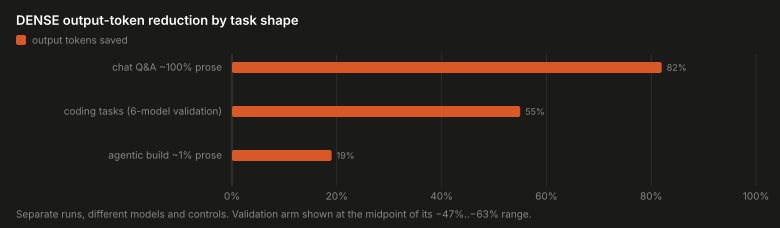
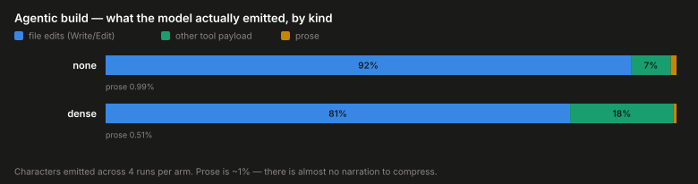

<p align="center">
  
</p>

# DENSE

A ~550-token skill prompt that makes a coding model write less — less prose, less code, less
ceremony — **without a noticeable impact on correctness**. `SKILL.md` is the whole thing (MIT).

```bash
mkdir -p ~/.claude/skills/dense && cp SKILL.md ~/.claude/skills/dense/
# or paste its body in as a system prompt for any model
```

The claim it makes is narrow and testable: *terseness instructions save tokens; do they cost
correctness?* Every number below comes from **executing model-written code against hidden
tests** — never from reading the model's prose. The three figures in the table are **separate
runs with different methodologies** — different models, task sets and controls — so read them
as three independent readings of a task-shaped effect, not as points on one curve.

## Results




| measurement | task shape | DENSE effect |
|---|---|---|
| [six-model validation](benchmarks/DENSE_BENCHSET.md) | 10 coding tasks, hidden tests | **−47% to −63%** on frontier Claude models |
| [chat prompts](benchmarks/CAVEMAN_BENCHSET.md) | single-turn Q&A | **−82%** (caveman −62% on the same suite) |
| [agentic build](benchmarks/AGENTIC_BENCH.md) | 21-requirement engine, mostly file edits | **−19%** |

DENSE also costs a quarter of what the alternatives cost to install: 553 tokens per turn
against caveman's 2,009 and ponytail's 2,368 — overhead paid on *every* turn.

**The effect is strongly task-shaped.** A compression skill can only remove ceremony the model
was going to write. Chat answers are almost entirely ceremony; a 900-line database engine is
almost entirely not — on the agentic task, prose was ~1% of everything the model emitted:



Tested and evolved on multistep tasks; real long-horizon use is not validated formally, only on
a subjective basis. If you are willing to contribute real-life stats, feel free!

## Details

Full methodology, per-model and per-task tables, raw data, runners and caveats live in
[**`benchmarks/`**](benchmarks/):

- [`DENSE_BENCHSET.md`](benchmarks/DENSE_BENCHSET.md) — the six-model validation run: how the
  skill was built, results by model and task, the method, and the caveats. **Single pass per
  cell; read the caveats before quoting any number.**
- [`CAVEMAN_BENCHSET.md`](benchmarks/CAVEMAN_BENCHSET.md) — caveman's own 10-prompt suite, run
  through the Claude Code CLI against a verified clean control.
- [`AGENTIC_BENCH.md`](benchmarks/AGENTIC_BENCH.md) — a long, low-prose, file-edit-dominated
  agentic task, where the compressible surface is smallest.
